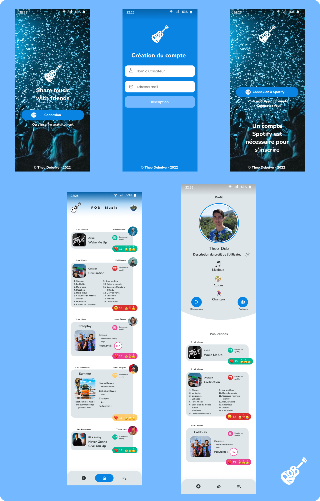
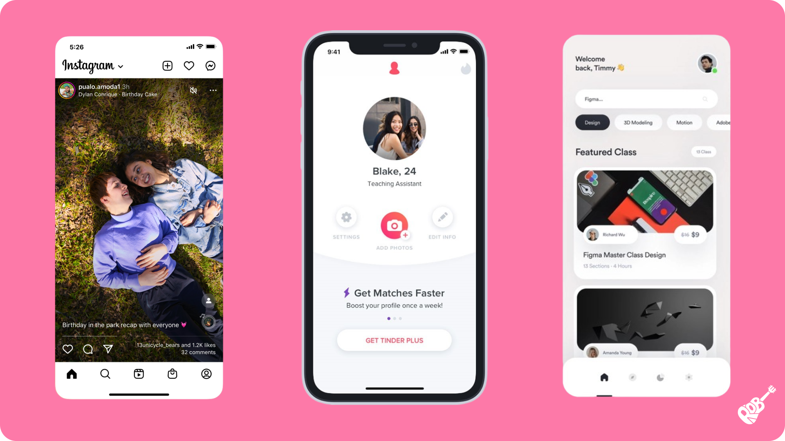
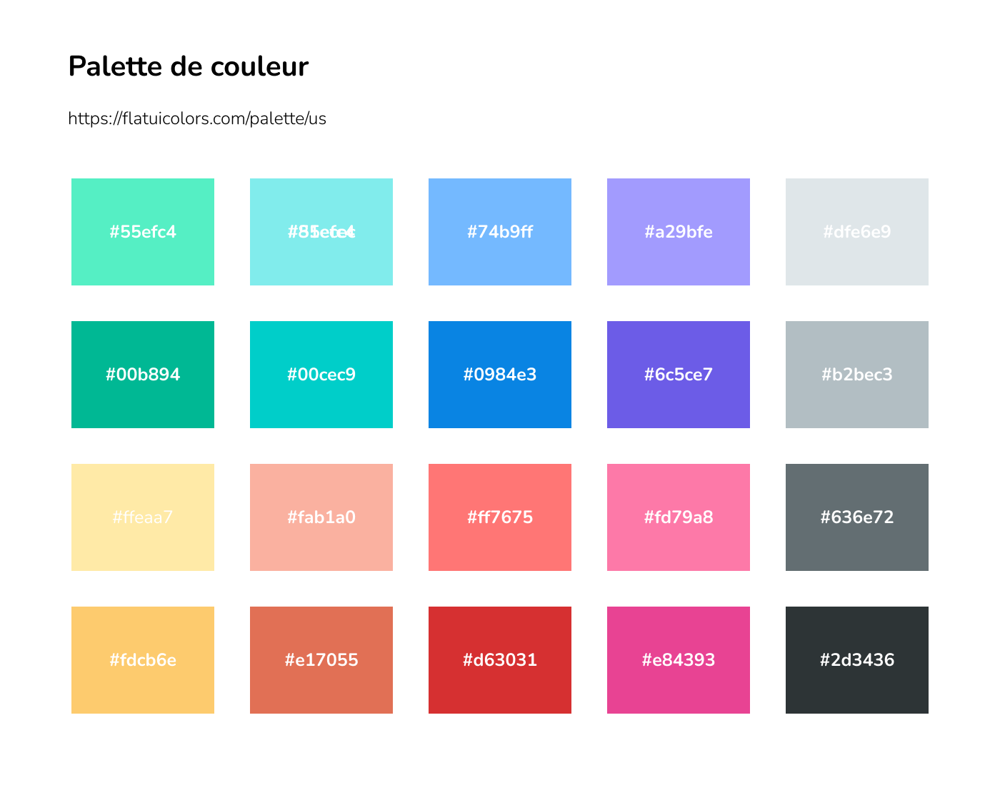

# ROB music
##### Projet d’examen 2022-2023 - Theo Debefve
Ce projet va être créé dans le cadre du cours de ”Développement d’applications mobiles”.
L’objectif de ce projet est de donner un cadre pour développer une application mobile en Flutter afin d’asseoir les concepts vus en cours. Ce projet est aussi une occasion de réfléchir à l’expérience utilisateur sur les petits et moyens écrans.

## :iphone: Description de l'application
ROB music a pour but de partager la musique que l'on aime avec ses amis. C'est un réseau social sur lequelle on peut partager nos chansons, album, artiste, playlist préférées avec vos amis. Lorsqu'une chanson vous plaît, vous pourrez l'ajouter simplement à votre playlist ROB qui sera directement synchronisée a votre compte Spotify.

## :zap: Applications existantes
Après quelques recherches, aucunes applications avec se concept n'existent. 

## :dizzy: Fonctionnalités de l'application
* En tant qu'utilisateur, je veux pouvoir créer un compte afin de pouvoir rejoindre l'application > Sign in
* En tant qu'utilisateur, je veux pouvoir me connecter pour avoir accès  à l'application > Log in
* En tant qu'utilisateur, je veux pouvoir consulter les posts de mes amis > Home
* En tant qu'utilisateur, je veux pouvoir ajouter des amis > ...
* En tant qu'utilisateur, je veux pouvoir ajouter une réaction aux postes de mes amis > Home
* En tant qu'utilisateur, je veux pouvoir ajouter un post > Add
* En tant qu'utilisateur, je veux pouvoir ajouter les musiques de mon fil à ma playlist ROB > playlist
* En tant qu'utilisateur, je veux pouvoir consulter le profil de mes amis > ...
* En tant qu'utilisateur, je veux pouvoir modifier mon profil > Profil
* En tant qu'utilisateur, je veux pouvoir me déconnecter > Profil

## :lipstick: Maquette

## :art: Moodboard

Je me suis principalement inspiré d'applications populaires telles que Instagram pour la page d'accueil ou alors Tinder pour le profil. J'ai aussi trouvé certaines inspirations sur Dribbble.

## :world_map: Site Map

Chaque rectangle bleu correspond à une page dans l'application. Chaque mot en noir correspond à un bouton et chaque flèche a une connexion entre 2 pages.

## :card_file_box: Ressources

[:see_no_evil: Emoji](https://www.figma.com/community/file/937774188065101204)
[:art: Palette de couleur](https://flatuicolors.com/palette/us)
[:camera_flash: Image Login](https://unsplash.com/photos/tIr-PWgSYB4)
[:bookmark: Icones](https://www.figma.com/community/file/937774188065101204)