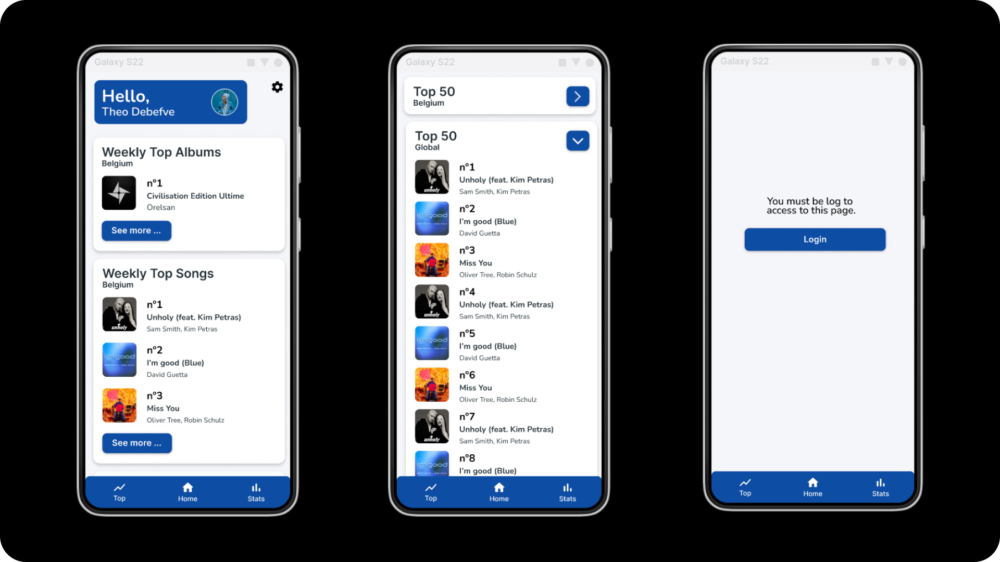
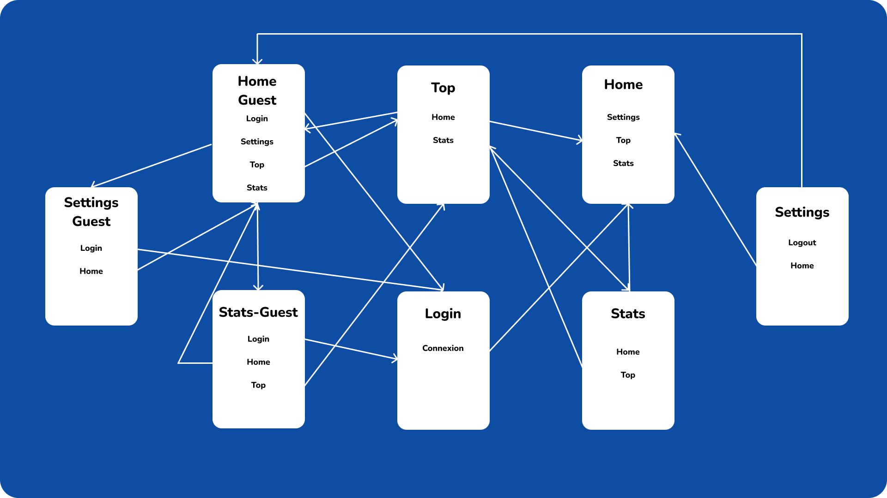

# Seal.fm
##### Projet d'examen 2022-2023 - Theo Debefve

Ce projet va être créé dans le cadre du cours de ”Développement d’applications mobiles”.
L’objectif de ce projet est de donner un cadre pour développer une application mobile en Flutter afin d’asseoir les concepts vus en cours. Ce projet est aussi une occasion de réfléchir à l’expérience utilisateur sur les petits et moyens écrans.

## :iphone: Description de l'application

Seal.fm est une application qui permet de voir vos musique et artiste préférée sur Spotify. Vous pouvez aussi consulter les musiques les plus écoutées en Belgique et dans le monde. Une simple connexion avec votre compte Spotify sera nécessaire pour utiliser l'application.

## :dizzy: Fonctionnalités de l'application

* **En tant qu'utilisateur,** je veux pouvoir voir les 5 titres les plus populaires cette semaine en Belgique.
* **En tant qu'utilisateur,** je veux pouvoir voir les 5 artistes les plus populaires cette semaine en Belgique.
* **En tant qu'utilisateur,** je veux pouvoir voir les 5 albums les plus populaires cette semaine en Belgique.
* **En tant qu'utilisateur,** je veux pouvoir consulter la page Top (avec le Top 100) sans me connecter.
* **En tant qu'utilisateur,** je veux pouvoir me connecter avec mon compte Spotify.
* **En tant qu'utilisateur connecté avec Spotify,** je veux pouvoir voir les titres que j'ai le plus écouté durant les 4 dernières semaines, les 6 derniers mois ou depuis la création du compte.
* **En tant qu'utilisateur connecté avec Spotify,** je veux pouvoir voir les artistes que j'ai le plus écoutés durant les 4 dernières semaines, les 6 derniers mois ou depuis la création du compte.
* **En tant qu'utilisateur connecté avec Spotify,** je veux pouvoir me déconecter.

## :lipstick: Maquette

Dans cette partie il n'est pas nécessaire d'être connecté avec Spotify.

Connexion

Dans cette partie il est nécessaire d'être connecté avec Spotify.

## :zap: Applications existantes

Après quelques recherches, un site internet et une application proposent la même chose. Les 2 ont des inconvénients que j'aimerais corriger dans mon application.

* https://www.statsforspotify.com/  
Ce site permet de voir les artistes et les musiques les plus écoutées durant les 4 dernières semaines, les 6 derniers mois ou depuis la création du compte. Le principal problème de ce site internet c'est l'interface utilisateur qui n'est pas très agréable a utilisé.

* https://stats.fm/ (Application Android & IOS)  
Cette application propose plus de fonctionnalités que ce que je vais proposer dans mon application. Son principal problème c'est qu'elle est payante. Un autre problème que j'ai pu trouver dans cette application c'est le manque de lisibilité. Ils ont voulu ajouter tellement de chose que ça en devient presque illisible. L'application est beaucoup trop surchargée.

## :world_map: Site Map

Chaque rectangle correspond à une page dans l'application. Chaque mot en noir correspond à un bouton et chaque flèche à une connexion entre 2 pages.

## :card_file_box: Ressources

[:iphone: Image Login](https://www.figma.com/community/file/880534892514982400)
[:camera_flash: Image Login](https://unsplash.com/photos/tIr-PWgSYB4)
[:bookmark: Icones](https://www.figma.com/community/file/937774188065101204)